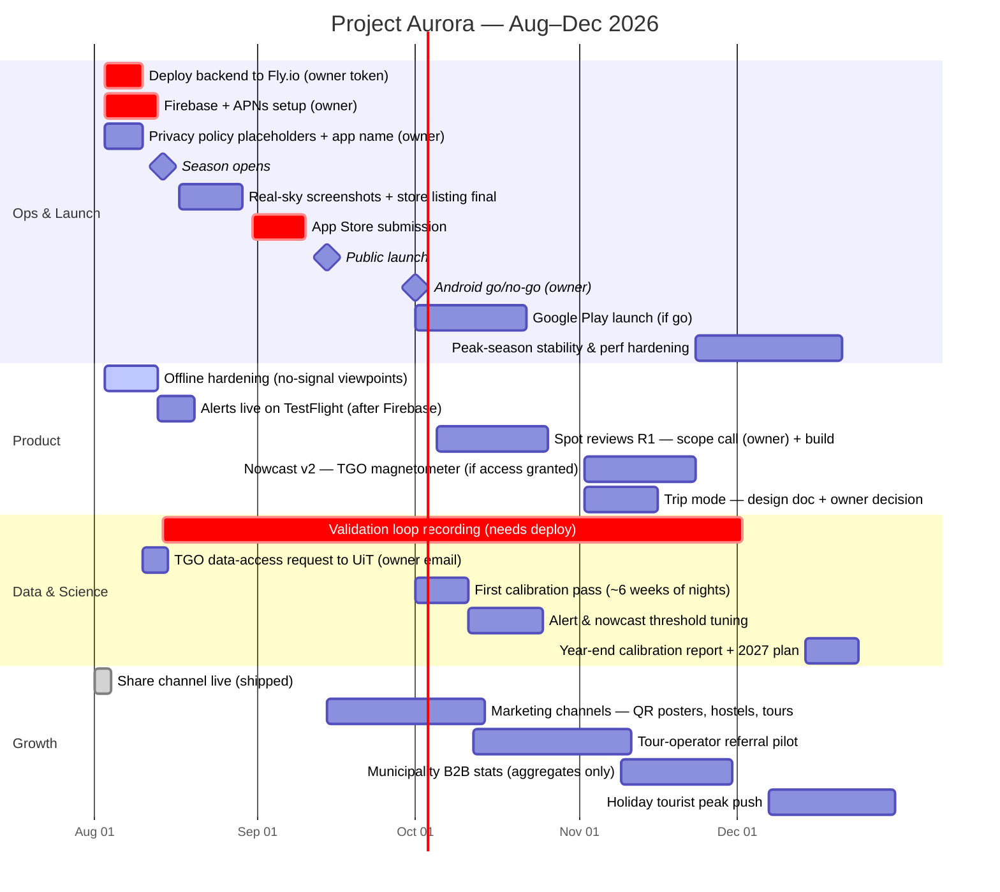

# Product Roadmap — Rest of 2026

Aurora season opens ~Aug 14. Strategic goal: real user traction by April 2027
(see `docs/roadmap-2026-27.md` for the full-season strategy this compresses).

Owner-gated items are marked `(owner)` — they block whatever follows them.

## Reading the critical path

1. **Aug (now):** everything hinges on the two owner ops items — the Fly.io
   token (backend deploy) and Firebase/APNs. The validation loop only starts
   learning once the backend runs, and the season opens Aug 14; every day
   undeployed after that is lost calibration data. Offline hardening is the
   last pre-launch product item and needs no owner input.
2. **Sep:** App Store submission as soon as real-sky screenshots exist
   (sample-data banner shown honestly, never cropped). Public launch mid-Sept
   into the rising season; marketing channels activate the same week so the
   `?src=` tracking has somewhere to point.
3. **Oct:** first calibration pass turns six weeks of recorded predictions
   into threshold tuning for the score, alerts, and nowcast. Android decision
   gates a Play launch. Reviews R1 starts only after the owner's scope call
   on the design doc's open decisions.
4. **Nov:** deeper science (TGO if UiT grants access), Trip-mode decision
   (privacy-gated — design doc first, owner sign-off, no code before that),
   and the municipality B2B aggregate stats — the first monetization lever.
   *2026-09-04: shipped early as a product feature; tourism measurement
   consented at first launch — see decision doc
   (`docs/decision-tourism-baseline.md`).*
5. **Dec:** peak tourist season — stability over features, holiday marketing
   push, and the year-end calibration report that sets up the April 2027
   traction checkpoint.

## Not on this roadmap (deliberately)

- Expansion beyond Tromsø aurora (owner decision: stay focused).
- The eats sibling app (concept doc exists; separate effort).
- Any location tracking beyond the aggregate, consented events we ship today —
  Trip mode enters only as a *design doc* in November, not as code.
  *2026-09-04: shipped early as a product feature; tourism measurement
  consented at first launch — see decision doc.*
